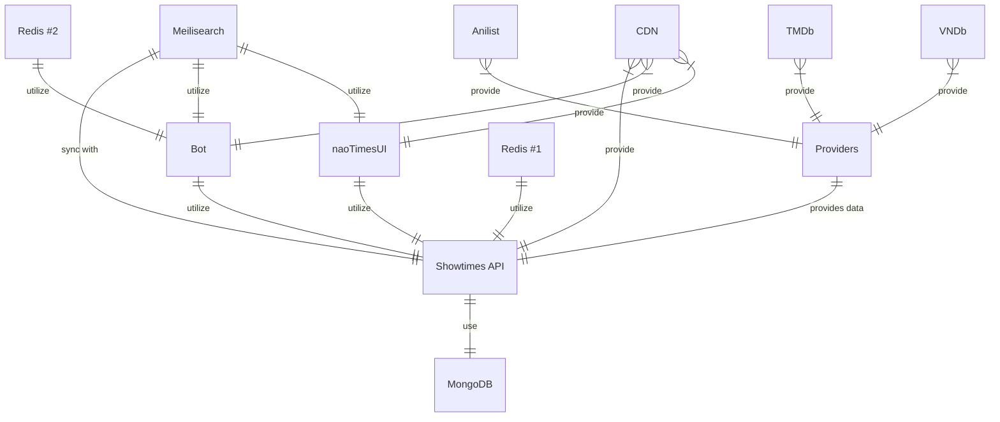

Notation for code block

```ts meta
console.log("hewwo"); // [!code ---]
console.log("hello"); // [!code +++]
console.log("goodbye"); // aosdk
```

```ts meta
console.log("Not highlighted");
console.log("Highlighted"); // [!code highlight]
console.log("Not highlighted");
```

```ts meta
// [!code highlight:3]
console.log("Highlighted");
console.log("Highlighted");
console.log("Not highlighted");
```

```ts meta
// [!code word:Hello]
const message = "Hello World";
console.log(message); // prints Hello World
```

```ts meta
console.log("Not focused");
console.log("Focused"); // [!code focus]
console.log("Not focused");
```

```ts meta
// [!code focus:3]
console.log("Focused");
console.log("Focused");
console.log("Not focused");
```

```ts meta
console.log("No errors or warnings");
console.error("Error"); // [!code error]
console.warn("Warning"); // [!code warning]
```

```py [manaria01_descale.vpy] meta lineNumbers
import vapoursynth as vs
from vapoursynth import core

import fvsfunc as fvf
import descale

src = core.ffms2.Source('Manaria Friends - 01v2 (AbemaTV 1080p).mkv')
src = fvf.Depth(src, 16)

src.set_output() # Hello world!
```

```py [manaria01_descale.vpy] {7} meta lineNumbers startLine=15
import vapoursynth as vs # With
from vapoursynth import core

import fvsfunc as fvf
import descale

src = core.ffms2.Source('Manaria Friends - 01v2 (AbemaTV 1080p).mkv') # Simulate a long ass line for this thing how does this look btw?
src = fvf.Depth(src, 16) # C

src.set_output() # Love gonna get you killed
```

## Typo test

(c) (C) (r) (R) (tm) (TM) (p) (P) +-

test.. test... test..... test?..... test!....

Replica?!

But WHY!?

!!!!!! ???? ,, -- ---

10-20

This is with complete number 10-20

## Katex Test

$$\sum_{i=1}^n(x_i^2 - \overline{x}^2)$$

Lift($$L$$) can be determined by Lift Coefficient ($$C_L$$) like the following
equation.

$$
L = \frac{1}{2} \rho v^2 S C_L
$$

## Mermaid Test


